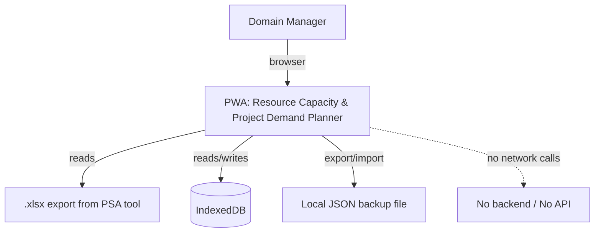
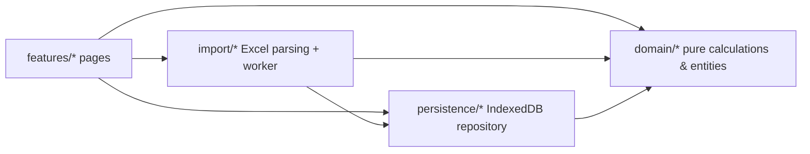

# Architecture

## Context



No server, no authentication, no external API calls for business data. Local-only.

## Components



## Stack

React 18 · TypeScript strict · Vite · Tailwind CSS v4 (`@tailwindcss/vite`) · React Router (`HashRouter`) · `idb` · `zod` · `react-hook-form` · `@tanstack/react-table` + `@tanstack/react-virtual` · `recharts` · `@dnd-kit` · `xlsx` · `lucide-react` · Vitest + React Testing Library · Playwright · ESLint + Prettier · GitHub Actions.

## Repository layout

```
public/assets/biomerieux-logo.jpeg
src/
  app/               # routing, app shell (AppShell, Sidebar, nav config)
  domain/
    entities/        # zod schemas + types
    calculations/     # capacity/workload/comparison formulas (framework-free)
    normalization/    # normalizeAmount and friends
  persistence/        # IndexedDB repository, migrations, backup
  import/             # Excel parsing, classification, worker
  features/            # one folder per page (dashboard, capacity, demand-coverage, ...)
  components/          # shared UI (KPI cards, status badges, filter bar, icons barrel)
    ui/                # base UI primitives (Button, Card, Tabs, Tooltip, IconButton, TableShell)
  theme/               # theme resolution + persistence (applyTheme, useThemePreference)
  workers/
  index.css            # branding, verbatim copy of data/index.css — never rewritten
  design-tokens.css    # companion token layer (elevation/shadow) — see docs/adr/0002
docs/
tests/{unit,component,e2e}/
AGENTS.md
.github/copilot-instructions.md
ai.memory
```

## Why HashRouter

GitHub Pages serves static files with no server-side rewrite rule for SPA deep links. A `BrowserRouter` with `basename` would 404 on refresh/direct navigation to any route other than `/`. `HashRouter` sidesteps this entirely — all routing state lives after the `#`, so any URL always resolves to `index.html`. Revisit only if GitHub Pages adds first-class SPA fallback support (see `ai.memory`, 2026-09-08).

## Why IndexedDB + JSON backup (not "a JSON file" as primary storage)

The original requirement text says "sauvegarder en local dans fichier JSON", which conflicts with performance/index requirements for thousands of allocations. Resolved (see `ai.memory` ADR-0001) as: IndexedDB is the source of truth (indexed, transactional, quota-managed), JSON is the **export/backup/restore format**, satisfying both the performance need and the "critical, non-optional backup" requirement.
