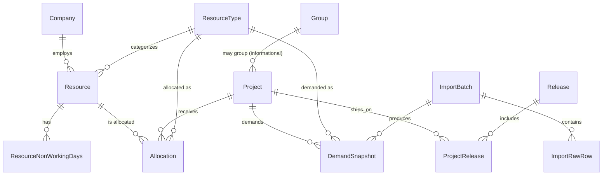

# Data Model

Authoritative TypeScript/Zod definitions live in `src/domain/entities/` (Lot 2). This document is the human-readable reference and must stay in sync.

## Entity overview

## Entities

| Entity                   | Functional key                                              | Notes                                                                                  |
| ------------------------ | ----------------------------------------------------------- | -------------------------------------------------------------------------------------- |
| `AppSettings`            | singleton (`"app-settings"`)                                | display precision, visual thresholds, numeric tolerance, theme, schema/backup versions |
| `Company`                | `name` (unique)                                             | required for external resources                                                        |
| `ResourceType`           | `label` (unique)                                            | immutable id, color, displayOrder, archive not delete if referenced                    |
| `Resource`               | id (immutable)                                              | fullName is computed, never persisted redundantly                                      |
| `Release`                | `name` (unique)                                             | one `goLiveDate`                                                                       |
| `Project`                | `code` (regex `^[EPR]\d{4}$`)                               | never merged by name                                                                   |
| `Group`                  | `code` (non-conforming)                                     | read-only, import-created only                                                         |
| `ProjectRelease`         | `(projectId, releaseId)`                                    | join entity                                                                            |
| `WorkingDaysCalendar`    | `(year, month)` unique                                      |                                                                                        |
| `ResourceNonWorkingDays` | `(resourceId, year, month)` unique                          |                                                                                        |
| `ImportBatch`            | id + `fileSha256` (dedup)                                   | immutable once `validated`                                                             |
| `ImportRawRow`           | `(importBatchId, rowNumber)`                                | diagnostic raw data, includes classification                                           |
| `DemandSnapshot`         | `(projectCode, resourceTypeId, year, month, importBatchId)` |                                                                                        |
| `Allocation`             | id                                                          | `(resourceId, projectCode, resourceTypeId, year, month)` for lookups                   |
| `ChangeSet`              | id                                                          | structured entity diff (audit/undo foundation)                                         |
| `AuditEntry`             | id                                                          | human-readable log line                                                                |

## Archiving strategy

Every entity with a `status` field uses `active | archived`. Hard delete is only exposed in the UI when zero references exist (checked via repository lookups before allowing the action).

## Migration strategy

IndexedDB schema version is a single incrementing integer (`DB_VERSION` in `src/persistence/db.ts`). Each version bump adds one migration function; migrations are additive and never destructive without an explicit backup prompt. See `persistence-and-backup.md` for the backup-format versioning (independent of the IndexedDB schema version).

## Numeric storage

All day-amount fields are plain `number`, unrounded. Normalization to zero for float noise happens only at calculation/read time via `normalizeAmount`, never mutating stored values silently.

## Current demand resolution

- `DemandSnapshot` history is append-only.
- The **current effective demand** for a `(projectCode, resourceTypeId, year, month)` key is the **latest snapshot by `updatedAt` then `createdAt`**, regardless of whether it came from a validated `ImportBatch` or from a manual-adjustment snapshot.
- Functional rollback therefore does **not** mutate or delete historical imports. It creates new `DemandSnapshot` rows with `origin = manual-adjustment` and `importBatchId = 'manual'`, so the restored values become current while the full import history stays auditable.
- If a key is absent from the restored import but currently present, rollback writes a `0`-demand manual snapshot for that key to make the effective current state match the selected historical version explicitly.
